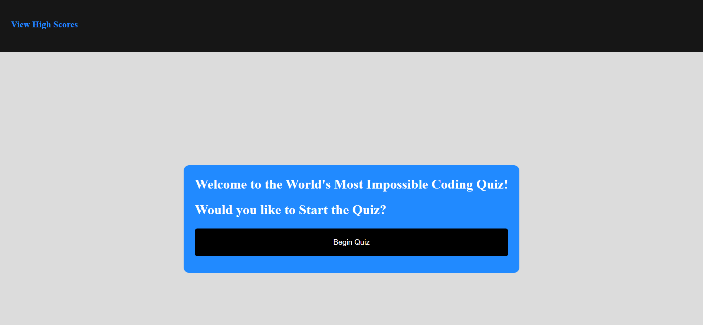
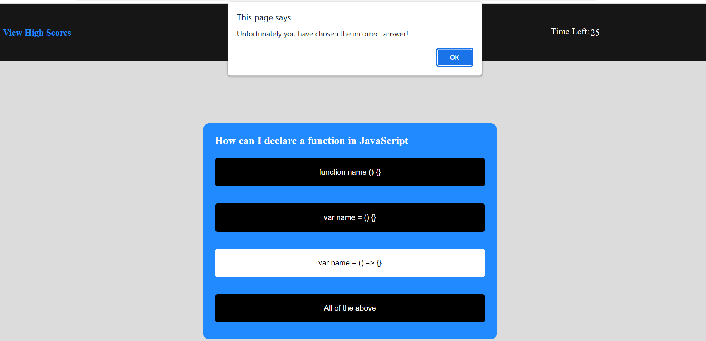
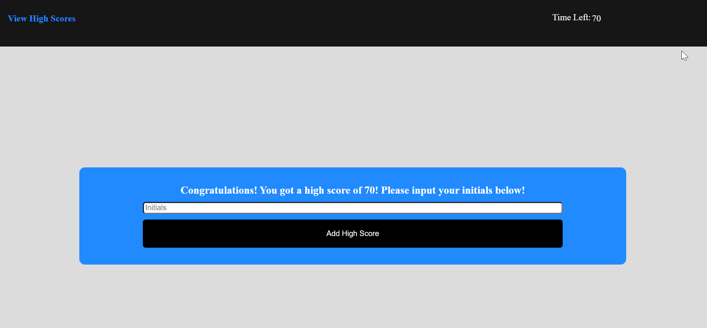
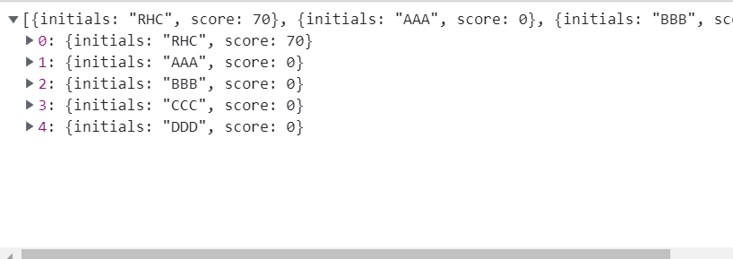

# Coding Quiz

# Description

This project presents the user with a quiz on the fundamentals of Javascript. The user can start the quiz by selecting the Begin Quiz button on the screen.

Once the user begins the quiz, A timer shows in the upper right hand corner of the screen and counts down. The user will be presented with a multiple choice question.

The user will select what they believe is the best answer. Once the answer is clicked the browser will alert them whether they have selected the right or wrong answer. Then, there will be a 10 second penalty for wrong answers and a 5 second bonus for correct answers.

Once the penalty is assessed the quiz will move on to the next question

Once the user has completed all of the questions or has run out of time, then the program will evaluate if the user has obtained a top five score for the round. If the user has obtained a top five score, then it will prompt the user to put in their initials and store their high score. If not, then it will prompt them to restart the quiz.

Once the user has put in their high score, then the quiz will go back to the beginning screen so that the user can take it again if they wish.

At any time, the user may click the view high scores link in the upper left hand corner of the screen to look at the high scores for that browser session.

Link:
